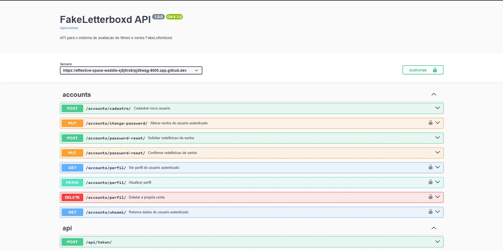
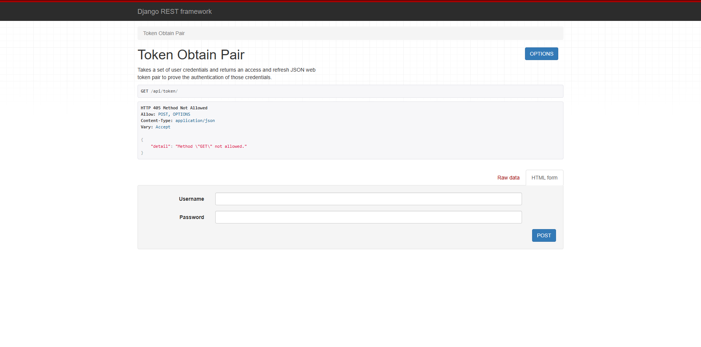
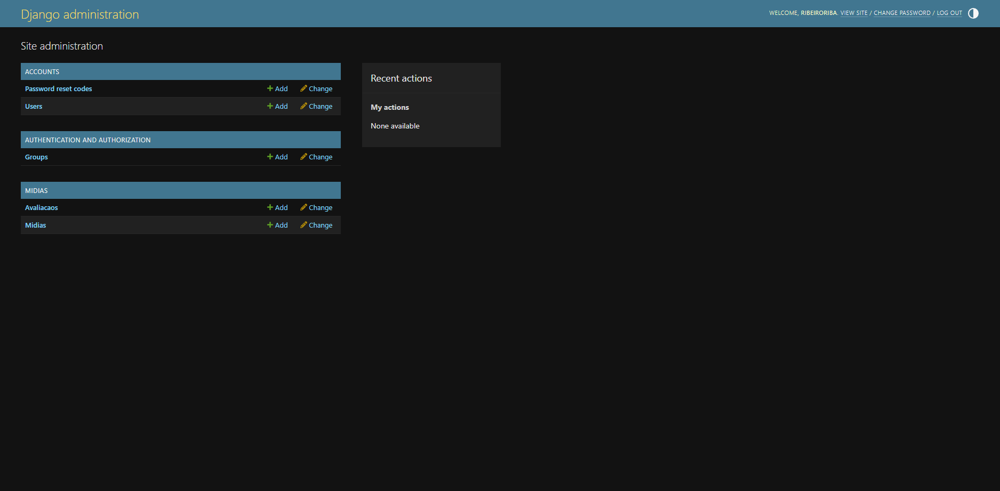

# FakeLetterboxd — Backend

> Uma plataforma de avaliações de filmes e séries inspirada no Letterboxd, desenvolvida como trabalho acadêmico da disciplina de Programação para Web (INF1407) — PUC-Rio, 2026/1.

**Autores:** Luísa Silveira · Rafael Ribeiro

---

## 🔗 Links

| Recurso | URL |
|---|---|
| Site do Frontend | `<https://fake-letterboxd-two.vercel.app/>` |
| Site do Backend | `https://luisas4.pythonanywhere.com/` |
| Repositório do Frontend | `<https://github.com/LuisaSilveira/inf1407-FakeLetterboxd-Projeto2-Frontend/>` |
| Repositório do Backend | `<https://github.com/LuisaSilveira/inf1407-FakeLetterboxd-Projeto2-Backend>` |

---

## Descrição do Projeto

O **FakeLetterboxd** é um sistema inspirado na popular rede social de filmes. Este repositório contém exclusivamente a **API RESTful (Backend)** do projeto, desenvolvida utilizando o framework **Django** e **Django REST Framework (DRF)**.

O backend foi projetado para atuar estritamente como uma API de dados, fornecendo respostas no formato JSON. Cumprindo os requisitos do projeto, o código não contém arquivos HTML, CSS ou Javascript (a interface visual fica inteiramente a cargo do frontend).

As principais funcionalidades incluem:
- **Gerenciamento de Usuários:** Cadastro, edição de perfil, exclusão de conta, alteração e recuperação de senha via código enviado por e-mail (em formato *plain-text*). 
- **CRUD de Mídias e Avaliações:** Endpoints para criar, ler, atualizar e deletar avaliações de filmes e séries, com suporte a filtros dinâmicos de busca.
- **Integração Externa:** Consulta na OMDb API no lado do servidor para alimentar a base, evitando expor a chave de integração.

---

## 🖼️ Imagens da Aplicação

Como o backend consiste apenas na API (sem interface de usuário final), as imagens abaixo demonstram o funcionamento interno e a documentação:

| Documentação Swagger | Teste de Autenticação | Django Admin |
|---|---|---|
|  |  |  |

> As imagens acima se encontram na pasta `docs/` do repositório.

---

## ⚙️ Instalação Local

### Pré-requisitos
- [Python 3.10+](https://www.python.org/)

### Passos

```bash
# 1. Clone o repositório
git clone https://github.com/LuisaSilveira/inf1407-FakeLetterboxd-Projeto2-Backend
cd inf1407-FakeLetterboxd-Projeto2-Backend/projeto-letterboxd

# 2. Crie e ative um ambiente virtual
# No Windows:
python -m venv venv
.\venv\Scripts\activate
# No Linux/Mac:
python3 -m venv venv
source venv/bin/activate

# 3. Instale as dependências
pip install -r requirements.txt

# 4. Aplique as migrações no banco de dados
python NossoProjeto/manage.py migrate

# 5. Inicie o servidor
python NossoProjeto/manage.py runserver
```

> **Nota:** Para o fluxo de "Esqueci minha senha" funcionar localmente, crie um arquivo `.env` na raiz do projeto (mesmo nível do `manage.py`) com as credenciais (veja `EMAIL_HOST_USER` e `EMAIL_HOST_PASSWORD` no settings).

---

##  Autenticação e Segurança

A API utiliza **JWT (JSON Web Tokens)** (`rest_framework_simplejwt`) para autenticação de requisições. 

- O endpoint de login `/api/token/` devolve um `access_token` e um `refresh_token`.
- O `access_token` deve ser inserido no cabeçalho das requisições subsequentes no formato: `Authorization: Bearer <seu_token>`.
- O CORS está configurado nativamente com `django-cors-headers` para permitir acessos `Cross-Origin` de domínios frontend independentes (`CORS_ALLOW_ALL_ORIGINS = True`).

---

## Manual da API (Como funciona)

### 1. Documentação Interativa (Swagger)
A API está totalmente documentada utilizando o `drf-spectacular`. Ao rodar a aplicação localmente, basta acessar:
- **Swagger UI:** [http://127.0.0.1:8000/api/schema/swagger-ui/](http://127.0.0.1:8000/api/schema/swagger-ui/)

Lá você encontrará a lista de todos os endpoints, parâmetros aceitos e a possibilidade de realizar testes diretos pelo navegador.

### 2. Endpoints Disponíveis
A API oferece uma estrutura robusta dividida em dois Apps principais:

**App `accounts`** (Controle de Usuário e Autenticação):
- `POST /api/token/` - Geração de tokens de acesso.
- `POST /api/token/refresh/` - Atualização do token.
- `POST /accounts/cadastro/` - Criação de novos usuários.
- `GET/PUT/DELETE /accounts/perfil/` - CRUD do perfil autenticado.
- `PUT /accounts/change-password/` - Alteração de senha logado.
- `POST /accounts/password-reset/` - Envia token para reset de senha (plain text).
- `POST /accounts/password-reset/confirm/` - Confirma a nova senha com o token.

**App `midias`** (Gerenciamento de Avaliações):
- `GET/POST /midias/avaliacao/` - Criação e Listagem de avaliações (com filtros dinâmicos via `query params`).
- `GET/PUT/DELETE /midias/avaliacao/<id>/` - Detalhe, atualização e exclusão de uma avaliação específica. A API valida se o usuário autenticado é o dono da avaliação.
- `GET /midias/busca-omdb/` - Busca de filmes e séries de forma segura na OMDb.

---

## Avaliação do Escopo

### O que testamos e funcionou:
- O CRUD completo de usuários (cadastro, atualização de perfil, exclusão) e de avaliações, integrados ao banco de dados SQLite.
- Sistema de autenticação via JWT com renovação de tokens.
- O fluxo de envio de e-mail em texto puro (`.txt`) para a recuperação de senha, garantindo a regra imposta de não possuir HTML no back-end.
- Comunicação interdomínio (CORS configurado para permitir a comunicação com o Vercel/Netlify sem bloqueios no navegador).
- Documentação da API de forma autogerada com o DRF Spectacular.

### O que testamos e não funcionou:
- **Upload e Exibição de Foto de Perfil:** Nós tentamos implementar a possibilidade do usuário enviar e exibir uma foto de perfil, assim como havíamos feito no Projeto 1. Desenvolvemos o suporte no backend com `ImageField` e adaptamos o frontend para enviar a imagem via `FormData`. Porém, encontramos dificuldades técnicas para realizar a exibição correta dessa imagem na integração e na hora de gerenciar/hospedar os arquivos estáticos de forma separada, e por isso decidimos remover e deixar a funcionalidade de fora para focar no que era essencial.

---

## ⚙️ Tecnologias Utilizadas

- **Python 3**
- **Django** — framework web backend principal
- **Django REST Framework (DRF)** — criação da API RESTful
- **Simple JWT** — controle de autenticação via JSON Web Tokens
- **drf-spectacular** — geração de esquemas OpenAPI e Swagger UI
- **django-cors-headers** — liberação de origens e segurança de rotas
- **SQLite** — banco de dados padrão

---

*Trabalho desenvolvido para a disciplina INF1407 — Programação para Web · PUC-Rio · 2026/1*